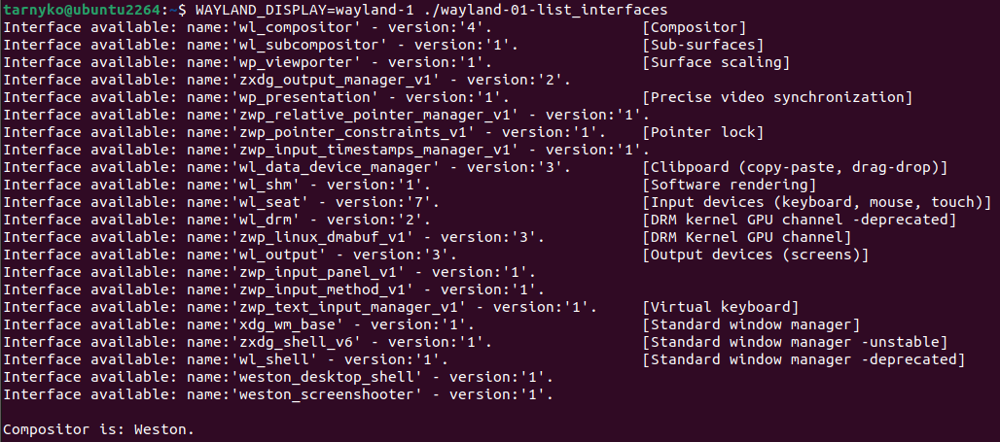
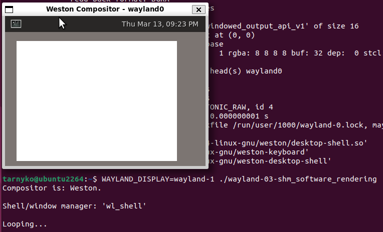

Simple Wayland clients
======================

Demonstration for using the **[Wayland](https://en.wikipedia.org/wiki/Wayland_(protocol))** display protocol API.

Verified compatible since Wayland & Weston [1.5.0](https://lists.freedesktop.org/archives/wayland-devel/2014-May/014955.html) *(2014/05/20)*.\
Able to use newer features:

  * [Vulkan](https://en.wikipedia.org/wiki/Vulkan) rendering ;
  * [XDG Shell](https://wayland.app/protocols/xdg-shell) (for minimization with [xdg_toplevel_set_minimized()](https://wayland.app/protocols/xdg-shell#xdg_toplevel:request:set_minimized) ) ;
  * ...


Prerequisites
-------------

  * Debian/Ubuntu:

```sudo apt install libwayland-dev libegl-dev libgles-dev libvulkan-dev```

  * Fedora/RHEL:

```sudo dnf install wayland-devel libglvnd-devel vulkan-loader-devel```


Building
--------

    make

To disable Vulkan samples:

    VULKAN=0 make
    
To build the [libdecor](https://gitlab.freedesktop.org/libdecor/libdecor/) sample:

    DECOR=1 make
    
To be a real gU4u:

    DEBUG=1 make


List
----

  * **[wayland-01-list_interfaces](wayland-01-list_interfaces.c)** :

Lists the current Wayland compositor's supported [interfaces](https://wayland.app/protocols/).
 


&nbsp;


  * **[wayland-02-list_interfaces-opengl_vulkan](wayland-02-list_interfaces-opengl_vulkan.c)** :

Lists the current Wayland compositor's supported [interfaces](https://wayland.app/protocols/) and versions of [EGL](https://en.wikipedia.org/wiki/EGL_(API))/[OpenGL](https://en.wikipedia.org/wiki/OpenGL)([ES](https://en.wikipedia.org/wiki/OpenGL_ES)) & [Vulkan](https://en.wikipedia.org/wiki/Vulkan). 


&nbsp;


  * **[wayland-03-shm_software_rendering](wayland-03-shm_software_rendering.c)** :

Displays a white square in [Software](https://wayland.app/protocols/wayland#wl_shm) mode.



&nbsp;


  * **[wayland-04-shm_software_rendering-redraw](wayland-04-shm_software_rendering-redraw.c)** :

Displays a square in [Software](https://wayland.app/protocols/wayland#wl_shm) mode, and uses the integrated [Callback](https://wayland.app/protocols/wayland#wl_surface:request:frame) mechanism to draw color pixels as fast as possible without [tearing](https://en.wikipedia.org/wiki/Screen_tearing).

([video demo](https://github.com/Tarnyko/suave_code_samples/raw/refs/heads/master/C/wayland/res/wayland-04-shm_software_rendering-redraw.mp4))

&nbsp;


  * **[wayland-05-accelerated_rendering-opengl](wayland-05-accelerated_rendering-opengl.c)** :

Displays a white-to-black blinking square in [EGL](https://en.wikipedia.org/wiki/EGL_(API))/[OpenGL](https://en.wikipedia.org/wiki/OpenGL) mode ([OpenGL ES](https://en.wikipedia.org/wiki/OpenGL_ES) is used if possible; otherwise [desktop OpenGL](https://en.wikipedia.org/wiki/OpenGL)).

([video demo](https://github.com/Tarnyko/suave_code_samples/raw/refs/heads/master/C/wayland/res/wayland-05-accelerated_rendering-opengl.mp4))

&nbsp;


  * **[wayland-06-accelerated_rendering-vulkan](wayland-06-accelerated_rendering-vulkan.c)** :
  
Displays a white-to-black blinking square in [Vulkan](https://en.wikipedia.org/wiki/Vulkan) mode.

([video demo](https://github.com/Tarnyko/suave_code_samples/raw/refs/heads/master/C/wayland/res/wayland-06-accelerated_rendering-vulkan.mp4))

&nbsp;


  * **[wayland-07-input](wayland-07-input.c)** :

Displays a white square in [Software](https://wayland.app/protocols/wayland#wl_shm) mode, showing
[mouse](https://wayland.app/protocols/wayland#wl_pointer) position & click logs in the terminal.

([video demo](https://github.com/Tarnyko/suave_code_samples/raw/refs/heads/master/C/wayland/res/wayland-07-input.mp4))

&nbsp;


  * **[wayland-08-input_shell](wayland-08-input_shell.c)** :
  
Displays a window with a custom-drawn titlebar in [Software](https://wayland.app/protocols/wayland#wl_shm) mode,
with basic window management (a.k.a. "[shell](https://wayland.app/protocols/xdg-shell)") capabilities: move, maximize, un-maximize, minimize.\
It also shows [mouse](https://wayland.app/protocols/wayland#wl_pointer) position & click logs in the terminal.

([video demo](https://github.com/Tarnyko/suave_code_samples/raw/refs/heads/master/C/wayland/res/wayland-08-input_shell.mp4))

&nbsp;


  * **[wayland-08bis-input_shell-libdecor](wayland-08bis-input_shell-libdecor.c)** *(OPTIONAL)* :

*(Same as above, but)* uses the popular [libdecor](https://gitlab.freedesktop.org/libdecor/libdecor/) library to draw a titlebar and handle most [shell](https://wayland.app/protocols/xdg-shell) code.

Install prerequisite and build with:

        # Debian/Ubuntu
        sudo apt install libdecor-0-dev
        DECOR=1 make

&nbsp;


  * **[wayland-09-drag_and_drop](wayland-09-drag_and_drop.c)** :

*(Same as above, but)* with a gray square that follows the mouse, and the abilitiy to [drag & drop](https://wayland.app/protocols/wayland#wl_data_device) it from the window to another
(such as '*weston-terminal*') to display a dynamic message.

([video demo](https://github.com/Tarnyko/suave_code_samples/raw/refs/heads/master/C/wayland/res/wayland-09-drag_and_drop.mp4))

&nbsp;

